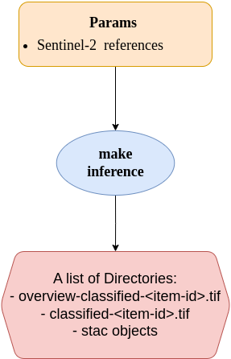

# Inference Module & CWL Runner

In the [training](training-container.md) mdule, the user trained a CNN model on EuroSAT dataset to classify image chips into 10 different classes and tracked the workflow with MLFlow.

In this Application Package, the user provide a cwl document to performs inference by applying the trained model to unseen data to generate a classified image. The cwl document containing one main workflow to execute one CommandLineTool step:

The Application Package takes as input a [staged-in](stage-in.md) Sentinel-2 L1C data and classifies it into 11 land cover classes:

| Class ID | Class Name            |
|----------|-----------------------|
| 0        | AnnualCrop            |
| 1        | Forest                |
| 2        | HerbaceousVegetation  |
| 3        | Highway               |
| 4        | Industrial            |
| 5        | Pasture               |
| 6        | PermanentCrop         |
| 7        | Residential           |
| 8        | River                 |
| 9        | SeaLake               |
| 10       | No Data               |

For executing the application package, the user have the options to use whether [cwltool](https://github.com/common-workflow-language/cwltool) or [calrissian](https://github.com/Duke-GCB/calrissian).

## Inputs
The CWL file takes as input a reference to a directory containing the staged Sentinel-2 L1C product.

## **How to Execute the Application Package?**

Before executing the application package with a CWL runner, the user must first stage in the Sentinel-2 L1C data. Instructions for doing this can be found in the [stage-in guide](./stage-in/README.md). Then update the latest docker image reference in the cwl file as below:
```
cd inference/app-package
VERSION="0.0.2"
curl -L -o "tile-sat-inference.${VERSION}.cwl" \
  "https://github.com/parham-membari-terradue/machine-learning-process-new/releases/download/${VERSION}/tile-sat-inference.${VERSION}.cwl"

```

### **Run the Application Package**:
There are two methods to execute the application:

- Executing the `tile-sat-inference` app using `cwltool` in a terminal:

    ```bash
    cwltool --podman --debug tile-sat-inference.cwl#tile-sat-inference params.yml
    ```

- Executing the water-bodies-app using `calrissian` in a terminal:

    ```bash
    
    calrissian --debug --stdout /calrissian/out.json --stderr /calrissian/stderr.log --usage-report /calrissian/report.json --max-ram 10G --max-cores 2 --tmp-outdir-prefix /calrissian/tmp/ --outdir /calrissian/results/ --tool-logs-basepath /calrissian/logs tile-sat-inference.cwl#tile-sat-inference params.yml
    ```

## How the CWL Document Works:
The CWL file can be triggered using `cwltool` or `calrissian`. The user provides a `params.yml` file that passes all inputs needed by the CWL file to execute the module. The CWL file is designed to execute the module based on the structure below:

<p align="center"></p>

> **`[]`** in the image above indicates that the user may pass a list of parameters to the application package.

The Application Package will generate a list of directories containing intermediate or final output. The number of folders containing a `{STAC_ITEM_ID}_classified.tif` and the corresponding STAC objects, such as STAC Catalog and STAC Item, depends on the number of input Sentinel-2 items.
